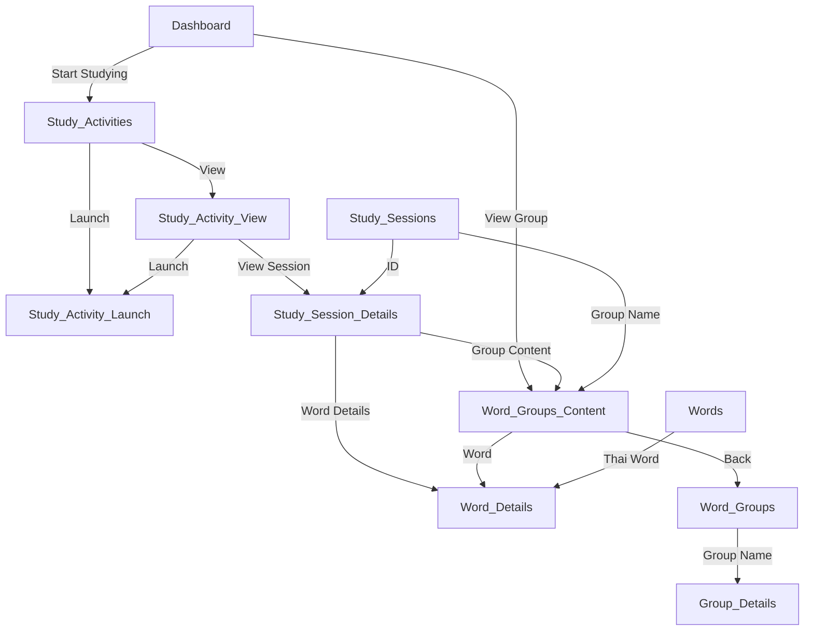

# GUI Functional Specification Document

## 1️⃣ Introduction
### **Purpose**
This document provides the **Graphical User Interface (GUI) Functional Specification** for the **Thai Language Learning Web Application**. It outlines the screens, UI elements, user interactions, and navigation flow. The document ensures consistency between design and functionality.

### **Scope**
The frontend of the application will provide:
- **Navigation via a static left menu** available on all screens.
- **Study activities for learning Thai words**, including Typing Tutor (more activities may be added in the future).
- **Tracking of study progress**, including correct and incorrect answers per word.
- **Word management**, allowing users to view words, their details, and their associations with word groups.
- **Study session tracking**, providing insight into past learning sessions.
- **Settings to control application behavior**.

---

## 2️⃣ General Navigation & Screen Flow

### **Static Left Menu (Available on all screens)**
The menu contains:
- **Dashboard**
- **Study Activities**
- **Words**
- **Word Groups**
- **Sessions**
- **Settings**

### **Screen-to-Screen Navigation**
- **Dashboard:**
  - "View Group" button → **Word Group Content Page**
  - "Start Studying" button → **Study Activities Page**
- **Study Activities Page:**
  - "Launch" button → **Study Activity Launch Page**
  - "View" button → **Study Activity View Page**
- **Study Activity View Page:**
  - "Launch" button → **Study Activity Launch Page**
  - **Table Links:**
    - **ID** → **Study Session Details Page**
    - **Activity Name** → **Study Activity Launch Page**
    - **Group Name** → **Word Group Content Page**
- **Study Session Details Page:**
  - **Activity Title** → **Study Activity View Page**
  - **Group Name** → **Word Group Content Page**
  - **Thai Words** → **Word Details Page**
  - **Back Button** → **Study Sessions List**
- **Study Sessions Page:**
  - **ID** → **Study Session Details Page**
  - **Activity Name** → **Study Activity Launch Page**
  - **Group Name** → **Word Group Content Page**
- **Word Groups Content Page:**
  - **Thai Word** → **Word Details Page**
  - **Back Button** → **Word Groups Page**
- **Word Groups Page:**
  - **Group Name** → **Group Details**
- **Word Details Page:**
  - **Button** → **Words Group Content Page**
- **Words Page:**
  - **Thai Word** → **Word Details Page**

### **Navigation Flowchart**

[View Navigation Flowchart](navigation_flowchart.jpg)

---

## 3️⃣ UI Components & Behavior

### **Dashboard**
- **Last Study Session**
  - **Activity Title & Date**
  - **Correct & Wrong Answer Counts**
  - **View Group Button**
- **Study Progress**
  - **Total Words Studied**
  - **Mastery Progress (%)**
- **Quick Stats**
  - **Success Rate**
  - **Total Study Sessions**
  - **Active Groups**
  - **Study Streak**
- **Start Studying Button**

### **Study Activity Launch Page**
- **Title of the study activity**
- **Select a Word Group Dropdown**
- **Launch Now Button**

### **Study Activity View Page**
- **Study Activity Title**
- **Screenshot of the activity**
- **Launch Button**
- **List of Past Study Sessions**

### **Word Details Page**
- **Thai Script**
- **Romanized Pronunciation**
- **English Translation**
- **Study Statistics (Correct/Wrong Answers Count)**
- **Word Groups the Word Belongs To**

### **Words Page**
- **List of Words with Pagination**
  - **Thai Script**
  - **Romanized Version**
  - **English Meaning**
  - **Correct/Wrong Guess Counts**

### **Study Sessions Page**
- **Table with Pagination**
  - **ID**
  - **Activity Name**
  - **Group Name**
  - **Start Time**
  - **End Time**
  - **Review Items Count**

### **Settings Page**
- **Theme Switch (Light/Dark Mode)**
- **Reset History Button (Requires Confirmation, Action is Irreversible)**

---

## 4️⃣ Future Considerations
- **Additional Study Activities** (Currently, only Typing Tutor is implemented, but more activities may be added.)
- **Renaming & Deleting Word Groups** (Not available now but may be implemented.)
- **Study History Reset is Irreversible** (Users must confirm before proceeding.)
- **No Animations or Transitions** planned for now.

---

## 5️⃣ Summary
This document defines the **GUI Functional Specification** for the Thai Language Learning Web Application, ensuring structured navigation, clear user interactions, and a consistent interface design. Future considerations are noted for planned features and improvements.
